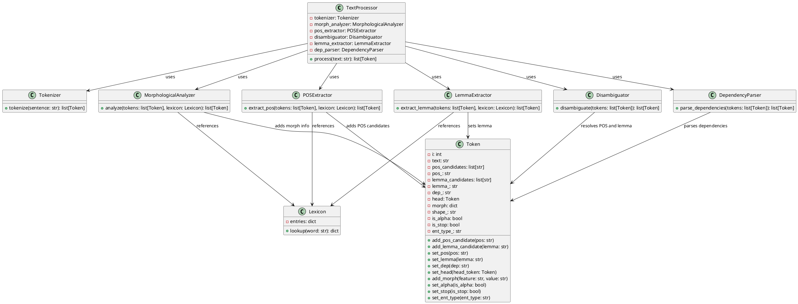
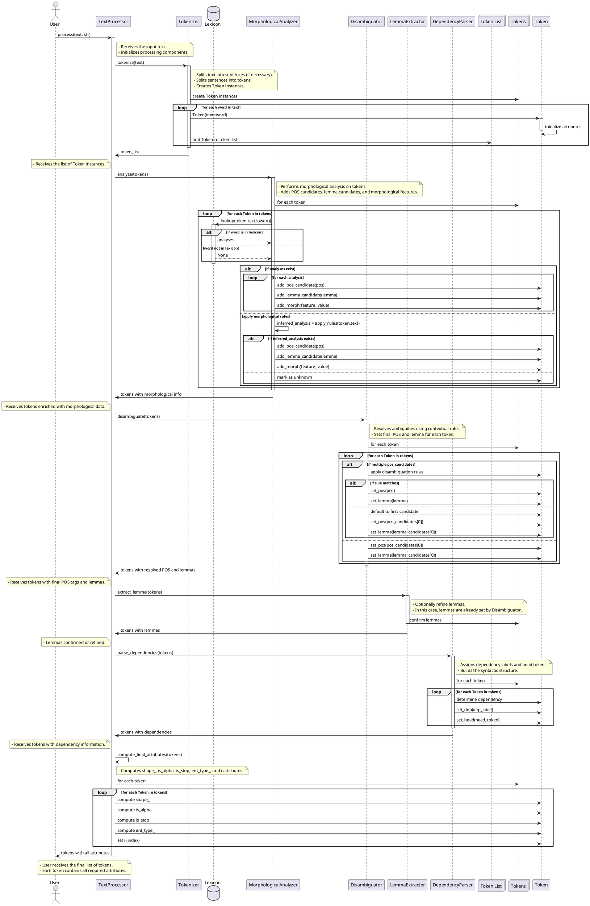

---
tags:
  - NLP
  - tps
---

**Strategies to Improve Accuracy in Token Extraction**

The syntactic ambiguities in French, especially the overlap between verb, noun, and adjective forms, pose significant challenges in achieving high accuracy in lemmatization and POS tagging. Here are strategies to address these challenges:

1. **Morphological Analysis Before POS Tagging**:
   - **Reordering the Pipeline**: Move the `MorphologicalAnalyzer` to precede the `POSExtractor`. Morphological analysis provides crucial information about a word's possible grammatical forms, which can significantly aid in accurate POS tagging.
   - **Morphosyntactic Integration**: Integrate morphological and syntactic analysis to consider both the form and function of words simultaneously.

2. **Contextual Disambiguation**:
   - **Implement a Disambiguator Module**: Introduce a `Disambiguator` component that uses contextual clues to resolve ambiguities. This module can apply hand-written rules that consider the surrounding words and their possible tags.
   - **Use N-gram Models**: Even within the constraints of hand-written rules, you can simulate n-gram models by creating rules that look at sequences of words or tags.

3. **Lexicon/Dictionaries**:
   - **Incorporate a Lexicon Class**: Add a `Lexicon` class containing entries for words with their possible lemmas and POS tags. This resource can be referenced during morphological analysis and POS tagging.
   - **Handle Homographs**: For words with multiple possible tags, the lexicon can list all options, which the disambiguator can then resolve based on context.

4. **Enhanced Token Representation**:
   - **Store Multiple Analyses**: Modify the `Token` class to store multiple possible POS tags and lemmas, along with confidence scores if applicable.
   - **Include Index Attribute**: Add an `i` attribute to `Token` to keep track of the token's position in the text, aligning with the spaCy format.

5. **Rule-Based Enhancements**:
   - **Develop Comprehensive Rules**: Expand your hand-written rules to cover more linguistic phenomena, such as agreement in gender and number, which can help disambiguate between adjectives and nouns.
   - **Exception Handling**: Create rules for irregular forms and exceptions that are common in French.

6. **Dependency Parsing Assistance**:
   - **Leverage Dependency Information**: Use preliminary dependency parsing to inform POS tagging. For instance, if a word is the subject of a verb, it's more likely to be a noun.

---

**Review and Improvements to the UML Schema**

The current UML schema provides a solid foundation but can be enhanced to address the syntactic challenges more effectively. Below is a detailed analysis and proposed improvements.

### **Current Issues in the UML Schema**

1. **Order of Processing Components**:
   - The `MorphologicalAnalyzer` comes after the `POSExtractor`, which limits its ability to aid in POS disambiguation.
   - Dependency parsing is performed before morphological analysis, which may not be optimal.

2. **Lack of Disambiguation Component**:
   - There's no dedicated component for syntactic disambiguation based on context.

3. **Token Class Limitations**:
   - Missing the `i` attribute for token index.
   - No provision for storing multiple possible analyses.

4. **Missing Lexicon Resource**:
   - No class represents a lexicon or dictionary for reference during analysis.

### **Proposed UML Schema Improvements**


![[Pasted image 20240921153614.png]]
### **Explanation of Improvements**

1. **Reordered Processing Steps**:
   - **MorphologicalAnalyzer** now comes before the `POSExtractor`, providing morphological insights that inform POS tagging.
   - **Disambiguator** is introduced after the POS extraction to resolve ambiguities using context.

2. **Introduction of Lexicon Class**:
   - The `Lexicon` class serves as a central repository of word forms, possible POS tags, and lemmas.
   - It's referenced by the `MorphologicalAnalyzer`, `POSExtractor`, and `LemmaExtractor`.

3. **Enhanced Token Class**:
   - Added `i` attribute to store the token's index, aligning with the spaCy format.
   - Introduced `pos_candidates` and `lemma_candidates` to store multiple possible analyses.
   - Methods `add_pos_candidate` and `add_lemma_candidate` allow the storage of multiple options before disambiguation.

4. **Disambiguator Component**:
   - A new `Disambiguator` class is responsible for resolving ambiguities using contextual rules.
   - It examines the `pos_candidates` and `lemma_candidates` of each token and selects the most appropriate ones.

5. **Updated Relationships**:
   - The `MorphologicalAnalyzer`, `POSExtractor`, and `LemmaExtractor` reference the `Lexicon` to enrich their analyses.
   - The `Disambiguator` modifies the `Token` by setting the final `pos_` and `lemma_` values.

---

**Handling Syntactic Disambiguation in French**

To address the challenges of syntactic disambiguation, especially for words with similar forms across different parts of speech, consider the following:

1. **Contextual Rules**:
   - Develop rules that consider the surrounding words and their possible tags. For instance, if a word is preceded by a determiner (`le`, `la`, `les`), it's more likely to be a noun or adjective.
   - Use agreement rules in gender and number to match adjectives with nouns.

2. **Syntactic Patterns**:
   - Identify common syntactic structures in French and use them to predict POS tags. For example, a typical noun phrase structure is `Determiner + Adjective + Noun`.

3. **Verb Conjugation Patterns**:
   - Use morphological analysis to detect verb conjugation endings, which can help distinguish verbs from nouns or adjectives.

4. **Probability and Frequency**:
   - While staying within hand-written rules, you can incorporate frequency information by prioritizing more common usages in ambiguous cases.
   - For homographs, default to the most frequent POS tag unless context dictates otherwise.

5. **Integration with Dependency Parsing**:
   - Use preliminary dependency parsing to provide additional context for disambiguation.
   - For example, if a word functions as the subject of a verb, it is likely a noun.

---

**Recommended Adjustments in Token Representation and Processing Logic**

1. **Token Class Enhancements**:
   - **Multiple Analyses**: Allow the `Token` class to store multiple possible POS tags and lemmas before disambiguation.
   - **Morphological Features**: Store detailed morphological features that can aid in disambiguation and agreement checking.

2. **Processing Logic Modifications**:
   - **Iterative Refinement**: Implement an iterative approach where initial analyses are refined at each processing step.
   - **Feedback Loops**: Allow later stages (like dependency parsing) to feedback into earlier stages (like POS tagging) for reevaluation if inconsistencies are found.

3. **Error Handling and Logging**:
   - Implement mechanisms to log ambiguous cases and the rules applied, which can help in debugging and further rule development.

4. **Alignment with spaCy Format**:
   - Ensure that all attributes required by the spaCy format are populated.
   - Compute `shape_`, `is_alpha`, `is_stop`, and `ent_type_` based on the token's characteristics and additional resources like stopword lists and named entity recognition rules.

**Developing the Necessary Steps for Morphological Analysis, Disambiguation, and Parsing**

To enhance your syntactic analyzer and address the challenges of French language ambiguities, it's essential to implement the Morphological Analyzer, Disambiguator, and Dependency Parser effectively. Below are the detailed steps to develop each of these components.

---

### **1. Morphological Analysis**

**Objective**: Enrich tokens with morphological information, such as possible part-of-speech (POS) tags, lemmas, and morphological features (e.g., gender, number, tense), using a lexicon and morphological rules.

**Steps**:

1. **Prepare a Comprehensive Lexicon**:
   - **Collect Data**: Gather a lexicon containing French words with their possible lemmas, POS tags, and morphological features. Resources like Lefff (Lexique des Formes Fléchies du Français) or GLAWI can be useful.
   - **Structure the Lexicon**: Organize the lexicon as a dictionary where each key is a word form, and the value is a list of possible analyses (POS, lemma, morphological features).

2. **Design the `MorphologicalAnalyzer` Class**:
   - **Attributes**:
     - `lexicon`: An instance of the `Lexicon` class.
   - **Methods**:
     - `analyze(tokens: List[Token]) -> List[Token]`: Enrich each token with possible POS tags, lemmas, and morphological features.

3. **Implement Morphological Analysis Logic**:
   - **Token Lookup**:
     - For each token, look up the word form in the lexicon.
     - If found, retrieve all possible analyses and add them to the token's candidates.
   - **Unknown Words Handling**:
     - Apply morphological rules to infer possible analyses for words not found in the lexicon (e.g., suffix stripping, affixation).
     - Consider using regular expressions to detect common morphological patterns.

4. **Update the `Token` Class**:
   - **Attributes**:
     - `pos_candidates`: List[str] — possible POS tags.
     - `lemma_candidates`: List[str] — possible lemmas.
     - `morph`: Dict[str, str] — morphological features.
   - **Methods**:
     - `add_pos_candidate(pos: str)`
     - `add_lemma_candidate(lemma: str)`
     - `add_morph(feature: str, value: str)`

5. **Example Implementation**:

   ```python
   class MorphologicalAnalyzer:
       def __init__(self, lexicon):
           self.lexicon = lexicon

       def analyze(self, tokens):
           for token in tokens:
               analyses = self.lexicon.lookup(token.text.lower())
               if analyses:
                   for analysis in analyses:
                       token.add_pos_candidate(analysis['pos'])
                       token.add_lemma_candidate(analysis['lemma'])
                       for feature, value in analysis['morph'].items():
                           token.add_morph(feature, value)
               else:
                   inferred_analysis = self.apply_rules(token.text)
                   if inferred_analysis:
                       token.add_pos_candidate(inferred_analysis['pos'])
                       token.add_lemma_candidate(inferred_analysis['lemma'])
                       for feature, value in inferred_analysis['morph'].items():
                           token.add_morph(feature, value)
           return tokens

       def apply_rules(self, word):
           # Implement morphological rules to infer possible analyses
           # Example: if word ends with 'ment', it might be an adverb
           return None  # Return None if no rules apply
   ```

---

### **2. Disambiguation**

**Objective**: Resolve ambiguities by selecting the most appropriate POS tag and lemma for each token based on contextual rules.

**Steps**:

1. **Design the `Disambiguator` Class**:
   - **Methods**:
     - `disambiguate(tokens: List[Token]) -> List[Token]`: Resolve ambiguities using contextual rules.

2. **Implement Disambiguation Logic**:
   - **Develop Contextual Rules**:
     - **Determinant-Noun Agreement**: If a token is preceded by a determiner and has POS candidates including 'NOUN' and 'VERB', select 'NOUN'.
     - **Verb Conjugation Patterns**: If a token matches known verb conjugation endings and is in a position typical for verbs, select 'VERB'.
     - **Syntactic Position**: Use the token's position in the sentence to inform POS selection (e.g., verbs typically follow subjects).

   - **Rule Prioritization**:
     - Assign priorities to rules based on their reliability.
     - Apply higher-priority rules first.

   - **Iterative Disambiguation**:
     - Apply rules iteratively, updating tokens until no changes occur.

3. **Update the `Token` Class**:
   - **Attributes**:
     - `pos_`: str — the final POS tag after disambiguation.
     - `lemma_`: str — the final lemma after disambiguation.

   - **Methods**:
     - `set_pos(pos: str)`
     - `set_lemma(lemma: str)`

4. **Example Implementation**:

   ```python
   class Disambiguator:
       def disambiguate(self, tokens):
           for idx, token in enumerate(tokens):
               if len(token.pos_candidates) > 1:
                   # Example rule: If previous token is a determiner
                   if idx > 0 and tokens[idx - 1].pos_ == 'DET':
                       if 'NOUN' in token.pos_candidates:
                           self.select_candidate(token, 'NOUN')
                           continue
                   # Additional rules can be added here
                   # Default to the first candidate if no rule applies
                   self.select_candidate(token, token.pos_candidates[0])
               else:
                   # Only one candidate, select it
                   token.set_pos(token.pos_candidates[0])
                   token.set_lemma(token.lemma_candidates[0])
           return tokens

       def select_candidate(self, token, pos_tag):
           index = token.pos_candidates.index(pos_tag)
           token.set_pos(token.pos_candidates[index])
           token.set_lemma(token.lemma_candidates[index])
   ```

5. **Develop a Set of Disambiguation Rules**:

   - **Agreement Rules**: Check for gender and number agreement between nouns and adjectives.
   - **Syntactic Patterns**: Recognize patterns like "Det + Noun" or "Noun + Verb".
   - **Verb-Noun Ambiguity**: Use context to decide between 'VERB' and 'NOUN' for words that can be both.

---

### **3. Dependency Parsing**

**Objective**: Establish grammatical relationships between tokens, such as subject, object, and modifiers.

**Steps**:

1. **Design the `DependencyParser` Class**:
   - **Methods**:
     - `parse_dependencies(tokens: List[Token]) -> List[Token]`: Assign dependency labels and head tokens to each token.

2. **Implement Dependency Parsing Logic**:

   - **Define Dependency Rules**:

     - **Subject Detection**:
       - If a noun precedes a verb, it is likely the subject (`nsubj`).
     - **Object Detection**:
       - If a noun follows a verb, it may be the object (`obj`).
     - **Modifier Attachment**:
       - Adjectives typically modify the nearest noun (`amod`).
     - **Prepositional Phrases**:
       - Prepositions connect nouns to verbs or other nouns.

   - **Build a Simple Parser**:

     - **Traversal**:
       - Iterate over tokens to establish dependencies based on the rules.
     - **Assign Heads and Labels**:
       - For each token, set the `head` token it depends on and the `dep_` label.

3. **Update the `Token` Class**:
   - **Attributes**:
     - `dep_`: str — dependency label (e.g., 'nsubj', 'obj').
     - `head`: Token — the token this one depends on.

   - **Methods**:
     - `set_dep(dep: str)`
     - `set_head(head_token: Token)`

4. **Example Implementation**:

   ```python
   class DependencyParser:
       def parse_dependencies(self, tokens):
           # Identify the root verb
           root_verb = None
           for token in tokens:
               if token.pos_ == 'VERB':
                   token.set_dep('ROOT')
                   token.set_head(token)
                   root_verb = token
                   break
           # Assign dependencies for other tokens
           for idx, token in enumerate(tokens):
               if token.dep_ == '':
                   if token.pos_ == 'NOUN':
                       if idx < tokens.index(root_verb):
                           token.set_dep('nsubj')
                           token.set_head(root_verb)
                       else:
                           token.set_dep('obj')
                           token.set_head(root_verb)
                   elif token.pos_ == 'ADJ':
                       # Modify the nearest noun
                       noun = self.find_nearest_noun(tokens, idx)
                       if noun:
                           token.set_dep('amod')
                           token.set_head(noun)
                   elif token.pos_ == 'DET':
                       # Attach to the following noun
                       noun = self.find_following_noun(tokens, idx)
                       if noun:
                           token.set_dep('det')
                           token.set_head(noun)
                   # Additional rules...
           return tokens

       def find_nearest_noun(self, tokens, idx):
           # Search backward and forward for the nearest noun
           for i in range(idx - 1, -1, -1):
               if tokens[i].pos_ == 'NOUN':
                   return tokens[i]
           for i in range(idx + 1, len(tokens)):
               if tokens[i].pos_ == 'NOUN':
                   return tokens[i]
           return None

       def find_following_noun(self, tokens, idx):
           for i in range(idx + 1, len(tokens)):
               if tokens[i].pos_ == 'NOUN':
                   return tokens[i]
           return None
   ```

5. **Handle Complex Structures**:

   - **Coordinate Structures**: Implement rules to handle conjunctions.
   - **Relative Clauses**: Recognize relative pronouns and their dependencies.
   - **Passive Constructions**: Adjust dependencies for passive voice.

---

### **4. Integrating Components into the Processing Pipeline**

Update the `TextProcessor` class to reflect the new processing order and integrate all components.

**Processing Order**:

1. **Tokenization**: Split the text into tokens.
2. **Morphological Analysis**: Enrich tokens with morphological information.
3. **Disambiguation**: Resolve ambiguities to assign final POS tags and lemmas.
4. **Dependency Parsing**: Parse dependencies using the disambiguated tokens.
5. **Final Attribute Computation**: Compute attributes like `shape_`, `is_alpha`, `is_stop`, and `ent_type_`.

**Example Implementation**:

```python
class TextProcessor:
    def __init__(self):
        self.tokenizer = Tokenizer()
        self.lexicon = Lexicon()  # Initialize with your lexicon data
        self.morph_analyzer = MorphologicalAnalyzer(self.lexicon)
        self.disambiguator = Disambiguator()
        self.dep_parser = DependencyParser()

    def process(self, text):
        tokens = self.tokenizer.tokenize(text)
        tokens = self.morph_analyzer.analyze(tokens)
        tokens = self.disambiguator.disambiguate(tokens)
        tokens = self.dep_parser.parse_dependencies(tokens)
        tokens = self.compute_final_attributes(tokens)
        return tokens

    def compute_final_attributes(self, tokens):
        for token in tokens:
            token.shape_ = self.get_shape(token.text)
            token.is_alpha = token.text.isalpha()
            token.is_stop = token.text.lower() in STOP_WORDS  # Define your stop words list
            token.ent_type_ = self.get_entity_type(token.text)
            # Set 'i' attribute (token index)
            token.i = tokens.index(token)
        return tokens

    def get_shape(self, text):
        # Implement shape computation (e.g., 'Xxxx' for 'Ciel')
        shape = ''
        for char in text:
            if char.isupper():
                shape += 'X'
            elif char.islower():
                shape += 'x'
            elif char.isdigit():
                shape += 'd'
            else:
                shape += char
        return shape

    def get_entity_type(self, text):
        # Implement a simple named entity recognition or return a static value
        return 'O'  # 'O' for non-entity
```

---

### **5. Additional Considerations**

**Building and Maintaining the Lexicon**:

- **Automated Updates**: Implement scripts to update the lexicon from new data sources.
- **User Feedback**: Incorporate mechanisms to learn from corrections or user feedback.

**Error Handling and Logging**:

- **Verbose Logging**: Keep logs of the analysis process for debugging and improvement.
- **Exception Handling**: Ensure that the system gracefully handles unexpected inputs.

**Testing and Evaluation**:

- **Benchmark Sentences**: Create a diverse set of sentences to test various linguistic features.
- **Metrics**: Use precision, recall, and F1 score to evaluate performance.
- **Iterative Improvement**: Regularly refine rules and update the lexicon based on test results.

---

### **6. Example Application**

**Sentence**: "Le chat noir dort sur le canapé."

**Processing Steps**:

1. **Tokenization**:

   Tokens: ["Le", "chat", "noir", "dort", "sur", "le", "canapé", "."]

2. **Morphological Analysis**:

   - **"Le"**:
     - POS Candidates: ['DET']
     - Lemma Candidates: ['le']
     - Morph: {'Gender': 'Masc', 'Number': 'Sing'}
   - **"chat"**:
     - POS Candidates: ['NOUN', 'VERB']
     - Lemma Candidates: ['chat', 'chatter']
     - Morph: {'Gender': 'Masc', 'Number': 'Sing'}
   - **"noir"**:
     - POS Candidates: ['ADJ', 'NOUN']
     - Lemma Candidates: ['noir']
     - Morph: {'Gender': 'Masc', 'Number': 'Sing'}
   - **"dort"**:
     - POS Candidates: ['VERB']
     - Lemma Candidates: ['dormir']
     - Morph: {'Mood': 'Indicative', 'Tense': 'Present', 'Person': '3', 'Number': 'Sing'}
   - **"sur"**:
     - POS Candidates: ['ADP']
     - Lemma Candidates: ['sur']
   - **"le"**:
     - POS Candidates: ['DET']
     - Lemma Candidates: ['le']
     - Morph: {'Gender': 'Masc', 'Number': 'Sing'}
   - **"canapé"**:
     - POS Candidates: ['NOUN']
     - Lemma Candidates: ['canapé']
     - Morph: {'Gender': 'Masc', 'Number': 'Sing'}
   - **"."**:
     - POS Candidates: ['PUNCT']
     - Lemma Candidates: ['.']

3. **Disambiguation**:

   - **"chat"**:
     - Preceded by a determiner 'Le' and followed by an adjective 'noir'.
     - Select 'NOUN' as POS.
   - **"noir"**:
     - Modifies the noun 'chat'; select 'ADJ'.
   - **Other tokens**: Only have one POS candidate.

4. **Dependency Parsing**:

   - **"Le"** modifies "chat" (`det`).
   - **"chat"** is the subject of "dort" (`nsubj`).
   - **"noir"** modifies "chat" (`amod`).
   - **"dort"** is the root verb (`ROOT`).
   - **"sur"** introduces a prepositional phrase modifying "dort" (`prep`).
   - **"le"** modifies "canapé" (`det`).
   - **"canapé"** is the object of the preposition "sur" (`pobj`).
   - **"."** is punctuation attached to "dort".

5. **Final Tokens**:

   | Token    | POS   | Lemma    | Dep    | Head    |
   |----------|-------|----------|--------|---------|
   | Le       | DET   | le       | det    | chat    |
   | chat     | NOUN  | chat     | nsubj  | dort    |
   | noir     | ADJ   | noir     | amod   | chat    |
   | dort     | VERB  | dormir   | ROOT   | dort    |
   | sur      | ADP   | sur      | prep   | dort    |
   | le       | DET   | le       | det    | canapé  |
   | canapé   | NOUN  | canapé   | pobj   | sur     |
   | .        | PUNCT | .        | punct  | dort    |

**Detailed Sequence Diagram for Tokenization Process**

Below is the most detailed sequence diagram for the tokenization process, including all steps and interactions between the objects involved. The diagram is written in PlantUML format and captures every method call, data exchange, and internal processing step to ensure no detail is missed.

---


![[Pasted image 20240921153514.png]]
---

**Explanation of the Sequence Diagram**

The sequence diagram represents the detailed flow of the tokenization process within the `TextProcessor` system. Each step is expanded to show method calls, data processing, and interactions between components.

### **Participants and Objects**

- **User (U)**: Initiates the processing by providing the input text.
- **TextProcessor (TP)**: The main controller that orchestrates the processing pipeline.
- **Tokenizer (T)**: Splits the text into tokens and creates `Token` instances.
- **Lexicon (L)**: A database that contains word forms and their morphological analyses.
- **MorphologicalAnalyzer (MA)**: Performs morphological analysis on tokens.
- **Disambiguator (D)**: Resolves POS and lemma ambiguities using contextual rules.
- **LemmaExtractor (LE)**: Optionally refines lemmas; in this context, lemmas are set by the disambiguator.
- **DependencyParser (DP)**: Parses dependencies between tokens.
- **Token List (TL)**: A collection that holds all the `Token` instances.
- **Tokens**: Represents the individual tokens being processed.
- **Token (Token)**: The object representing a single token with various attributes.

### **Detailed Steps**

1. **User Initiates Processing**:
   - The user calls `process(text: str)` on the `TextProcessor`.
   - The `TextProcessor` starts processing the input text.

2. **Tokenization**:
   - `TextProcessor` calls `tokenize(text)` on the `Tokenizer`.
   - The `Tokenizer` splits the text into words and creates `Token` instances for each word.
     - For each word:
       - A `Token` is instantiated with `Token(text=word)`.
       - The `Token` initializes its attributes (e.g., `text`, `pos_candidates`, `lemma_candidates`, etc.).
       - The `Token` is added to the `Token List`.

3. **Morphological Analysis**:
   - `TextProcessor` calls `analyze(tokens)` on the `MorphologicalAnalyzer`.
   - The `MorphologicalAnalyzer` processes each `Token`:
     - Looks up the token's text in the `Lexicon`.
     - If analyses are found:
       - Adds POS candidates, lemma candidates, and morphological features to the `Token`.
     - If not found:
       - Applies morphological rules to infer possible analyses.
       - If inferred analyses exist:
         - Adds the inferred POS candidates, lemmas, and morphological features.
       - If no analyses can be inferred:
         - Marks the token as unknown.

4. **Disambiguation**:
   - `TextProcessor` calls `disambiguate(tokens)` on the `Disambiguator`.
   - The `Disambiguator` processes each `Token`:
     - If the token has multiple POS candidates:
       - Applies disambiguation rules based on context.
       - Sets the final `pos_` and `lemma_` for the `Token`.
     - If only one POS candidate exists:
       - Sets the `pos_` and `lemma_` directly.

5. **Lemma Extraction**:
   - `TextProcessor` calls `extract_lemma(tokens)` on the `LemmaExtractor`.
   - Since lemmas are already set by the `Disambiguator`, this step confirms the lemmas.
   - In cases where further refinement is needed, the `LemmaExtractor` can adjust lemmas.

6. **Dependency Parsing**:
   - `TextProcessor` calls `parse_dependencies(tokens)` on the `DependencyParser`.
   - The `DependencyParser` processes each `Token`:
     - Determines the dependency label (`dep_`) and head token (`head`) based on syntactic rules.
     - Assigns these values to the `Token`.

7. **Computing Final Attributes**:
   - `TextProcessor` computes additional attributes for each `Token`:
     - `shape_`: Represents the shape of the token (e.g., capitalization pattern).
     - `is_alpha`: Boolean indicating if the token consists of alphabetic characters.
     - `is_stop`: Boolean indicating if the token is a stop word.
     - `ent_type_`: Entity type; set to 'O' if the token is not part of a named entity.
     - `i`: The index of the token in the text.

8. **Final Output**:
   - The `TextProcessor` returns the list of tokens with all attributes to the user.
   - The user receives tokens ready for further processing or analysis, matching the spaCy format.

### **Notes and Considerations**

- **Activation Bars**: Represent the period an object is active during the process.
- **Loops**: Indicate iterative processing over collections, such as tokens.
- **Alternatives (alt)**: Represent branching logic based on conditions (e.g., if analyses are found in the lexicon).
- **Notes**: Provide additional context or explanations for certain steps.

### **Token Attributes Set During Processing**

- **During Tokenization**:
  - `text`: The original text of the token.
  - Initial attributes are set to default values or empty.

- **During Morphological Analysis**:
  - `pos_candidates`: Possible POS tags.
  - `lemma_candidates`: Possible lemmas.
  - `morph`: Morphological features (e.g., gender, number, tense).

- **During Disambiguation**:
  - `pos_`: The final POS tag after disambiguation.
  - `lemma_`: The final lemma after disambiguation.

- **During Dependency Parsing**:
  - `dep_`: Dependency label (e.g., 'nsubj', 'obj').
  - `head`: The head token this token depends on.

- **During Final Attribute Computation**:
  - `shape_`: Shape pattern of the token.
  - `is_alpha`: Whether the token is alphabetic.
  - `is_stop`: Whether the token is a stop word.
  - `ent_type_`: Entity type (e.g., 'PERSON', 'ORG', or 'O' for non-entities).
  - `i`: Index of the token in the original text.

### **Key Points Ensuring No Detail is Missed**

- **Every Method Call is Represented**: All interactions between components are included.
- **Data Flow is Explicit**: The passing of tokens and analyses between components is shown.
- **Conditional Logic is Illustrated**: The use of alternatives (alt) captures different execution paths.
- **Internal Processing is Expanded**: Notes and loops within components detail internal operations.
- **Object Lifetimes are Clear**: Activation bars indicate when objects are active and processing.

---

**Conclusion**

The sequence diagram provides a comprehensive view of the tokenization process within your syntactic analyzer. By capturing every interaction, method call, and processing step, it serves as a valuable reference for understanding and implementing the system. This level of detail ensures that all aspects of tokenization and subsequent analyses are accounted for, facilitating debugging, optimization, and further development.

Feel free to use this diagram as a blueprint for your implementation or ask for further elaboration on any specific part of the process.

