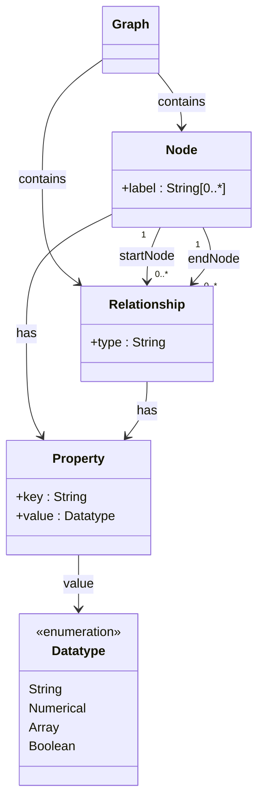

---
tags:
  - nosql
---
# Sommaire

1. [Introduction](#1-introduction)
   1.1. [Pourquoi NoSQL](#11-pourquoi-nosql)
   1.2. [Passage à l’échelle (Scalabilité)](#12-passage-à-léchelle-scalabilité)
      1.2.1. [Scalabilité horizontale (Scaling Out)](#121-scalabilité-horizontale-scaling-out)
      1.2.2. [Scalabilité verticale (Scaling Up)](#122-scalabilité-verticale-scaling-up)
   1.3. [Limites des bases de données relationnelles pour la scalabilité](#13-limites-des-bases-de-données-relationnelles-pour-la-scalabilité)
      1.3.1. [Fragmentation des schémas](#131-fragmentation-des-schémas)
      1.3.2. [Réplication complexe et impact sur la performance](#132-réplication-complexe-et-impact-sur-la-performance)
   1.4. [Principe CAP : Choix dans les Systèmes Distribués](#14-principe-cap--choix-dans-les-systèmes-distribués)
   1.5. [Compromis CAP dans les Bases de Données](#15-compromis-cap-dans-les-bases-de-données)
   1.6. [Représentation des Systèmes NoSQL et Cas d'Usage](#16-représentation-des-systèmes-nosql-et-cas-dusage)
      1.6.1. [Caractéristiques des Systèmes NoSQL](#161-caractéristiques-des-systèmes-nosql)
      1.6.2. [Exemples de Systèmes et Prouvés Conceptuellement](#162-exemples-de-systèmes-et-prouvés-conceptuellement)
      1.6.3. [Modes de Représentation des Données](#163-modes-de-représentation-des-données)
      1.6.4. [Exemples d’Utilisation de NoSQL par les Grandes Entreprises](#164-exemples-dutilisation-de-nosql-par-les-grandes-entreprises)
   1.7. [Positionnement de Neo4j dans le NoSQL](#17-positionnement-de-neo4j-dans-le-nosql)
2. [Graphes](#2-graphes)
   2.1. [Rappels](#21-rappels)
   2.2. [Structures de Support et Représentation en Graphe](#22-structures-de-support-et-représentation-en-graphe)
      2.2.1. [Structures de données pour les graphes](#221-structures-de-données-pour-les-graphes)
      2.2.2. [Cas d’utilisation des bases de données graphiques](#222-cas-dutilisation-des-bases-de-données-graphiques)
      2.2.3. [Forces des bases de données graphes](#223-forces-des-bases-de-données-graphes)
      2.2.4. [Modèle général des graphes (Property Graph Model)](#224-modèle-général-des-graphes-property-graph-model)
      2.2.5. [Types de bases de données graphiques](#225-types-de-bases-de-données-graphiques)
3. [Neo4J](#3-neo4j)
   3.1. [Specifications](#31-specifications)
   3.2. [Cypher](#32-cypher)

---

## 1. Introduction
### 1.1. Pourquoi NoSQL

Les bases de données NoSQL sont privilégiées pour des besoins spécifiques où les bases relationnelles ne conviennent pas :

- **Flexibilité du schéma** : NoSQL s’adapte aux changements fréquents dans les données sans nécessiter de refonte du schéma.
- **Données variées et incomplètes** : Gère facilement les entités aux caractéristiques variables.
- **Relations multiples** : Représente efficacement les relations complexes entre entités, surtout en bases orientées graphes.
- **Structures hiérarchiques** : Simplifie la gestion des entités avec des attributs composites.
- **Haut volume de transactions** : Optimisé pour des lectures et écritures rapides à grande échelle.
- **Données distribuées** : Facilite l'accès mondial grâce à un stockage distribué.

### 1.2. Passage à l’échelle (Scalabilité)

La scalabilité d'un système désigne sa capacité à gérer un nombre croissant d’utilisateurs, de transactions, ou de volume de données sans nécessiter une refonte de l’application. Elle se décline principalement en deux types :

#### 1.2.1. Scalabilité horizontale (Scaling Out)

- **Définition** : La scalabilité horizontale consiste à ajouter des serveurs supplémentaires pour répartir la charge de travail.
- **Avantage** : Elle permet d’augmenter les capacités du système de façon linéaire (par exemple, doubler le nombre de serveurs pour doubler la capacité de traitement).
- **Principe** :
    - Chaque nouveau serveur (ou "nœud") devient une unité supplémentaire capable de traiter des transactions.
    - Les données et le trafic sont partagés entre ces nœuds pour équilibrer la charge.
- **Exemple** : Si un serveur peut traiter 100 transactions par seconde, deux serveurs pourront en traiter 200, trois en traiter 300, etc., en théorie.
- **Adaptation aux systèmes NoSQL** : Les bases NoSQL favorisent ce type de scalabilité grâce à leur architecture décentralisée et flexible, particulièrement utile pour les grandes applications Web.

#### 1.2.2. Scalabilité verticale (Scaling Up)

- **Définition** : La scalabilité verticale consiste à améliorer les performances d'un serveur existant en ajoutant des ressources matérielles.
- **Méthodes** :
    - Ajouter des processeurs (CPU) pour augmenter la puissance de calcul.
    - Augmenter la mémoire (RAM) pour améliorer la gestion des données en mémoire.
    - Ajouter des disques de stockage plus rapides ou de plus grande capacité.
    - Améliorer la connectivité réseau pour augmenter la vitesse de transfert des données.
- **Limites** : La scalabilité verticale a des limites physiques et coûteuses. Une fois le serveur équipé de toutes les améliorations possibles, il devient difficile d'augmenter davantage sa capacité.

### 1.3. Limites des bases de données relationnelles pour la scalabilité

Les bases de données relationnelles (SGBDR) rencontrent des difficultés à répondre aux besoins des applications modernes qui nécessitent une grande flexibilité et une haute disponibilité :

1. **Fragmentation des schémas** : Les schémas des bases relationnelles doivent souvent être fragmentés pour être distribués. Cela se fait par :
    - **Fragmentation horizontale** : Division des lignes d'une table.
    - **Fragmentation verticale** : Division des colonnes d'une table.
    - **Fragmentation hybride** : Combinaison des deux approches pour répondre à des besoins spécifiques.
2. **Réplication complexe et impact sur la performance** :
    - **OLTP et intégrité des données** : Dans les bases relationnelles, la réplication de données sur différents nœuds pose des défis pour garantir une forte cohérence des transactions.
    - **Disponibilité limitée** : Plus il y a de nœuds et d’écritures dans le système, plus la gestion des transactions devient complexe, ce qui peut affecter la disponibilité et ralentir le traitement

### 1.4. Principe CAP : Choix dans les Systèmes Distribués

Le théorème CAP, énoncé par Eric Brewer, explique qu’un système distribué ne peut garantir simultanément les trois propriétés suivantes :

1. **Cohérence (Consistency)** : Les données sont instantanément synchronisées entre tous les nœuds.
2. **Disponibilité (Availability)** : Chaque requête reçoit une réponse, même en cas de panne.
3. **Tolérance aux partitions (Partition Tolerance)** : Le système reste fonctionnel malgré des nœuds inaccessibles.

### 1.5. Compromis CAP dans les Bases de Données

- **SGBDR** : Priorisent **Cohérence** et **Disponibilité**, avec une faible **Tolérance aux partitions**, adaptés aux environnements centralisés.
  
- **NoSQL** : Priorisent la **Tolérance aux partitions** pour gérer de nombreux nœuds et choisissent ensuite :
  - **Cohérence** (CP) : Acceptent des délais pour assurer la synchronisation.
  - **Disponibilité** (AP) : Répondent toujours, même avec des données potentiellement obsolètes.

Ainsi, le théorème CAP souligne que les SGBDR privilégient cohérence et disponibilité, tandis que les bases NoSQL, conçues pour le distribué, favorisent la tolérance aux partitions avec un choix entre cohérence et disponibilité selon les besoins.

### 1.6. Représentation des Systèmes NoSQL et Cas d'Usage

Les systèmes NoSQL offrent différentes approches pour répondre aux besoins des applications modernes, chacun avec ses propres spécificités et modes de représentation.

#### 1.6.1. Caractéristiques des Systèmes NoSQL

1. **APIs Spécifiques** : Chaque système propose des APIs adaptées à ses fonctionnalités uniques.
2. **Terminologies Propriétaires** : Les termes et concepts utilisés peuvent varier d’un système à l’autre.
3. **Requêtage à Géométrie Variable** : Les méthodes de requête diffèrent selon la structure de données (documents, graphes, colonnes, clés-valeurs).

#### 1.6.2. Exemples de Systèmes et Prouvés Conceptuellement

Certains systèmes NoSQL ont servi de "proofs of concept" et ont démontré la puissance des approches NoSQL :

- **BigTable** : Stockage structuré par colonnes, initié par Google.
- **Memcached** : Stockage clé-valeur, souvent utilisé pour la mise en cache.
- **Dynamo** d'Amazon : Stockage clé-valeur distribué, optimisé pour la tolérance aux pannes.

#### 1.6.3. Modes de Représentation des Données

|Nom|Mode de Représentation|
|---|---|
|**CouchDB**|Document|
|**Neo4j**|Graph|
|**Hbase**|Column|
|**Riak**|Key-Value|
|**Project Voldemort**|Key-Value|
|**Cassandra**|Column|
|**Hypertable**|Column|

#### 1.6.4. Exemples d’Utilisation de NoSQL par les Grandes Entreprises

|Entreprise|Système NoSQL Utilisé|Mode|
|---|---|---|
|**Google**|BigTable, LevelDB|Column|
|**LinkedIn**|Voldemort|Key-Value|
|**Facebook**|Cassandra|Column|
|**Twitter**|Hadoop/Hbase, Cassandra|Column|
|**Netflix**|SimpleDB, Hadoop/HBase, Cassandra|Column|
|**CERN**|CouchDB|Document|
|**Amazon**|Dynamo|Key-Value|

### 1.7. Positionnement de Neo4j dans le NoSQL

Neo4j, un système orienté graphe, se distingue dans le domaine NoSQL par sa capacité à gérer des relations complexes, rendant ce type de base de données particulièrement adapté pour représenter des associations naturelles et hiérarchiques. Les graphes permettent une visualisation intuitive des catégories et des associations, correspondant au "système mental" humain d'organisation des connaissances, notamment dans des domaines complexes comme la biologie ou les réseaux sociaux.

## 2. Graphes
### 2.1. Rappels 
- **Graphe** G=⟨V,E⟩G = \langle V, E \rangleG=⟨V,E⟩ :
    
    - **V** : Ensemble des sommets (ou nœuds) du graphe.
    - **E** : Ensemble des arêtes (ou liens) reliant les sommets.
- **Graphe orienté** :
    
    - Les arêtes sont des arcs, c’est-à-dire qu’elles ont une direction d'un sommet vers un autre.
- **Sous-graphe** G′=⟨V′,E′⟩G' = \langle V', E' \rangleG′=⟨V′,E′⟩ de G=⟨V,E⟩G = \langle V, E \rangleG=⟨V,E⟩ :
    
    - Un graphe constitué d'un sous-ensemble de sommets V′⊂VV' \subset VV′⊂V et d'arêtes E′⊂EE' \subset EE′⊂E de GGG.
- **Chemin** CCC entre deux nœuds v1v_1v1​ et v2v_2v2​ :
    
    - Séquence de nœuds et d'arêtes permettant de rejoindre v2v_2v2​ à partir de v1v_1v1​.
- **Graphe connecté** :
    
    - Un graphe est connecté s'il existe un chemin entre chaque paire de nœuds.
- **Cycle** :
    
    - Un chemin fermé, c'est-à-dire un chemin qui revient à son point de départ C(vi,vi)C(v_i, v_i)C(vi​,vi​).
- **Arbre** :
    
    - Un graphe qui est à la fois connecté et acyclique (sans cycle).
- **Parcours en largeur (BFS)** :
    
    - Exploration d'un graphe niveau par niveau, en visitant tous les voisins d’un sommet avant de passer aux niveaux suivants. Pratique pour trouver le chemin le plus court dans les graphes non pondérés.
- **Parcours en profondeur (DFS)** :
    
    - Exploration d'un graphe en suivant un chemin aussi loin que possible avant de revenir en arrière. Utile pour détecter des cycles et explorer toutes les composantes d'un graphe.
- **Recherche du plus court chemin (exemple : algorithme de Dijkstra)** :
    
    - Calcul du chemin le plus court entre deux nœuds dans un graphe pondéré. Dijkstra est efficace pour les graphes avec des poids positifs.
- **Mesures de centralité (exemple : centralité d'Eigenvector)** :
    
    - Indicateurs qui identifient les sommets les plus influents dans un graphe. La centralité d’Eigenvector, par exemple, valorise les nœuds connectés à d’autres nœuds influents.
- **Partitionnement** :
    
    - Division du graphe en sous-groupes (ou clusters) de sommets, souvent en maximisant les connexions internes et en minimisant les connexions entre groupes. Utile pour l’analyse communautaire.
- **Coloration** :
    
    - Attribution de couleurs aux sommets pour que deux sommets adjacents n’aient pas la même couleur. Utilisé pour des problèmes de planification ou d’ordonnancement.
- **Recherche de composantes connexes** :
    
    - Identification des sous-ensembles de sommets connectés entre eux. Les composantes connexes représentent des parties isolées ou indépendantes dans un graphe.

### 2.2. Structures de Support et Représentation en Graphe

Les structures de graphes sont soutenues par des structures de données spécifiques pour représenter efficacement les relations et connexions. Voici les éléments clés :

#### 2.2.1. Structures de données pour les graphes

1. **Liste d’adjacence** :
   - Représente les relations entre sommets sous forme de liste où chaque sommet répertorie ses voisins.
   - Avantage : Efficace pour les graphes peu denses avec moins d’arêtes.
   
2. **Matrice d’adjacence** :
   - Utilise une matrice pour indiquer la présence ou absence de liens entre chaque paire de sommets.
   - Avantage : Facilite l’accès rapide pour vérifier la connexion entre deux nœuds, mais peut être coûteux en mémoire pour les grands graphes.

#### 2.2.2. Cas d’utilisation des bases de données graphiques

Les systèmes NoSQL orientés graphes, comme Neo4j, sont adaptés à des domaines où les données et leurs connexions sont cruciales :

- **Réseaux sociaux** : Cartographie des relations entre utilisateurs (amis, abonnements).
- **Réseaux biologiques** : Analyse des interactions de protéines, des voies métaboliques.
- **Systèmes géographiques** : Représentation de territoires, relations géographiques (par exemple, géomatique).
- **Web de données et recommandations** : Navigation des données liées (Linked Open Data) et systèmes de recommandations.

#### 2.2.3. Forces des bases de données graphes

Les graphes sont puissants pour :

1. **Requêtes topologiques** : Identifier des chemins, explorer des relations (ex. “ami d’un ami”), ou optimiser des itinéraires.
2. **Modélisation complexe** : Gérer des volumes de données avec une connectivité complexe et une structuration partielle.

#### 2.2.4. Modèle général des graphes (Property Graph Model)

1. **Nœuds** : Représentent les entités.
2. **Propriétés** : Données descriptives attachées aux nœuds (ex. nom, âge) et aux relations.
3. **Arcs (relations)** : Connectent les nœuds et incluent des types (ou labels) pour identifier le genre de relation.
4. **Patterns** : Schémas qui révèlent des structures significatives dans les connexions.

#### 2.2.5. Types de bases de données graphiques

Les bases graphiques peuvent inclure des attributs (comme Neo4j) ou être adossées à des systèmes RDF (Triplestores) comme **Stardog** et **Sesame**. Parmi les systèmes populaires :

- **Neo4j** : Orienté graphe avec propriétés.
- **FlockDB (Twitter)** : Gestion de graphes de relations sociales.
- **Pregel (Google)** : Système de traitement de graphes pour des calculs massifs.
- **InfiniteGraph, DEX, OrientDB, HypergraphDB** : Bases de données graphiques avec divers cas d’usage et fonctionnalités.

## 3. Neo4J
### 3.1. Specifications

1. **Accès et manipulation des données** :
   - Neo4j offre divers outils et supports pour manipuler les données, notamment une **API Java de parcours de graphes** (Traversal Java API) qui permet de naviguer efficacement dans les graphes.

2. **Langages de requête** :
   - **Cypher** (et OpenCypher) : Le langage de requête principal de Neo4j, conçu pour des requêtes intuitives et expressives.
   - **Gremlin** : Un autre langage de requête de graphes, utilisé dans des systèmes multi-graphes.
   - **GQL (Graph Query Language)** : Un standard de langage de requête de graphes en cours de développement.

3. **Indexation** :
   - Neo4j utilise des index pour accélérer l'accès aux nœuds et aux relations, améliorant ainsi les performances de recherche.

4. **Mécanismes transactionnels (ACID)** :
   - Neo4j garantit les propriétés ACID (Atomicité, Cohérence, Isolation, Durabilité) pour assurer la fiabilité et l'intégrité des données lors des transactions.

5. **Architecture en cluster** :
   - La version payante de Neo4j inclut une architecture de clustering pour une meilleure distribution et disponibilité des données, bien que la distribution soit complexe dans les bases de données de graphes.

6. **Conçu pour le Web** :
   - Compatible avec Java EE, Neo4j s'intègre bien avec les frameworks **Spring** et **Spring Data**.
   - Supporte le web de données via **SAIL** et **SPARQL**.
   - Propose également une API et une **interface REST** pour faciliter les interactions avec des applications web.

### 3.2. Cypher

Principales clauses du langage de requête Cypher dans Neo4j :

1. **CREATE** :
    
    - Permet de créer des nœuds et des relations dans le graphe.
    - Exemple : `CREATE (n:Person {name: "Alice"})` crée un nœud de type `Person` avec une propriété `name` définie à "Alice".

2. **DELETE / REMOVE** :
    
    - **DELETE** : Supprime des nœuds et des relations du graphe.
    - **REMOVE** : Supprime des étiquettes ou des propriétés d’un nœud ou d’une relation.
    - Exemple : `DELETE n` pour supprimer un nœud `n`, et `REMOVE n:Label` pour retirer l’étiquette `Label` d'un nœud.

3. **SET** :
    
    - Met à jour les valeurs des propriétés d’un nœud ou d’une relation.
    - Exemple : `SET n.age = 30` pour définir ou mettre à jour la propriété `age` d’un nœud `n`.

4. **MATCH** :
    
    - Utilisé pour rechercher des motifs spécifiques dans le graphe, servant souvent de point d’entrée pour les requêtes.
    - Exemple : `MATCH (n:Person {name: "Alice"})` cherche un nœud de type `Person` avec `name` égal à "Alice".

5. **MERGE** :
    
    - Combine **MATCH** et **CREATE** : cherche d’abord le motif spécifié et le crée s’il n’existe pas.
    - Exemple : `MERGE (n:Person {name: "Bob"})` crée un nœud `Person` avec `name` "Bob" s’il n'existe pas déjà.

6. **WHERE** :
    
    - Utilisé pour poser des conditions de filtre dans les requêtes.
    - Exemple : `MATCH (n:Person) WHERE n.age > 25 RETURN n` retourne les nœuds `Person` dont l’âge est supérieur à 25.

7. **RETURN** :
    
    - Spécifie les nœuds, relations, ou propriétés à retourner dans les résultats de la requête.
    - Exemple : `MATCH (n:Person) RETURN n.name` retourne la propriété `name` de chaque nœud `Person` trouvé.

8. **UNION** :
    
    - Combine les résultats de plusieurs requêtes.
    - Exemple : `MATCH (n:Person) RETURN n.name UNION MATCH (m:Place) RETURN m.name` retourne les noms des `Person` et des `Place`.

9. **WITH** :
    
    - Fonctionne comme un pipe (similaire à la commande Unix) pour enchaîner des opérations sur les résultats intermédiaires.
    - Exemple : `MATCH (n:Person) WITH n.name AS name WHERE name STARTS WITH 'A' RETURN name` filtre les noms de `Person` commençant par "A".