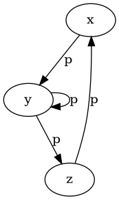
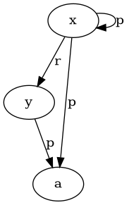
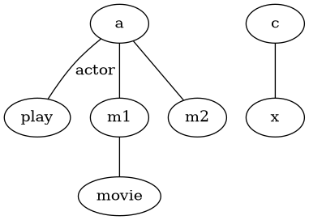
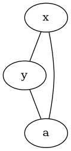
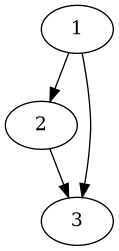

---
tags:
  - TBD
  - cours
---
Voici une version simplifiée et clarifiée du **Cours 2 : Homomorphismes**, adaptée pour un adolescent de 17 ans, tout en conservant les informations essentielles et les exemples.

---

# Cours 2 : Homomorphismes

### 1. Faits et requêtes conjonctives comme graphes

Les **bases de faits** et les **requêtes conjonctives** peuvent être représentées sous forme de **graphes** ou **hypergraphes**. Cela permet de mieux comprendre les relations entre les termes et d'analyser les homomorphismes.

#### Base de faits avec variables

Une **base de faits** est généralement un ensemble de **faits concrets**, où toutes les variables ont été remplacées par des constantes. Mais on peut aussi y inclure des **variables** pour représenter des informations incomplètes.

- Une base de faits **F** avec des variables est vue comme une **conjonction d'atomes**, où chaque variable est quantifiée existentiellement. Cela signifie qu'il existe une valeur pour chaque variable, mais cette valeur n'est pas connue.

**Exemple :**
```text
F = { movie(m1), movie(m2), movie(x), actor(a), actor(b), actor(c), 
      play(a, m1), play(a, m2), play(c, x) }
```
La formule logique associée serait :
```text
∃x (movie(m1) ∧ movie(m2) ∧ movie(x) ∧ actor(a) ∧ actor(b) ∧ actor(c) 
     ∧ play(a, m1) ∧ play(a, m2) ∧ play(c, x))
```
Ici, **x** est une variable dont la valeur est inconnue.

#### Requêtes conjonctives

Une **requête conjonctive (CQ)** est une formule de la forme :
```text
Q(x1, ..., xk) = ∃xk+1, ..., xm (A1 ∧ ... ∧ Ap)
```
Où :
- **A1, ..., Ap** sont des **atomes** (faits),
- **x1, ..., xk** sont les **variables réponses** (les valeurs qu'on cherche).

Cela signifie que les réponses à la requête sont les valeurs des variables **x1, ..., xk** qui satisfont les atomes.

**Exemple de requête conjonctive :**
```text
Q(x) = ∃y (movie(y) ∧ play(x, y))
```
Cela veut dire : "Trouver les acteurs **x** qui ont joué dans un film **y**".

#### Fragment existentiel conjonctif positif : FOL(∃, ∧)

Le fragment **FOL(∃, ∧)** représente des formules de la logique avec uniquement des **quantificateurs existentiels** (∃) et des **conjonctions** (∧). Ces formules sont parfaites pour modéliser des bases de faits et des requêtes.

En forme normalisée, une formule dans FOL(∃, ∧) s'écrit :
```text
∃x1 ... ∃xn (A1 ∧ ... ∧ Ap)
```
Les atomes **A1, ..., Ap** contiennent les variables **x1, ..., xn**, et chaque variable doit apparaître au moins une fois.

##### Homomorphisme

Pour deux formules **f1** et **f2**, on dit que **f1** est une **conséquence logique** de **f2** (noté **f1 ⊨ f2**) s'il existe un **homomorphisme** de **f2** vers **f1**. Cela signifie qu'on peut associer les variables et prédicats de **f2** à ceux de **f1** en gardant la structure.

---

### 2. Vision graphique : Graphes et hypergraphes

#### 2.1 Graphes orientés pour les bases de faits

- Un **graphe orienté** est noté **G = (V, E)**, où :
  - **V** est l'ensemble des **sommets** (termes),
  - **E** est l'ensemble des **arcs** reliant les sommets (atomes).

Un ensemble d'atomes avec un seul prédicat binaire peut être vu comme un **graphe orienté**.

**Construction du graphe** :  
Pour un ensemble d’atomes **A** avec des prédicats binaires, on construit un graphe **G = (V, E)** :
- **V** correspond aux termes de **A**,
- **E** correspond aux atomes de **A**.

**Exemple :**
Pour l'ensemble d'atomes suivant :
```text
{ p(x, y), p(y, z), p(z, x), p(y, y) }
```
Le graphe correspondant est :


#### 2.2 Hypergraphes pour les prédicats d'arité supérieure

Quand les prédicats ont une **arité supérieure à 2**, on utilise des **hypergraphes**. Dans un **hypergraphe**, un **hyperarc** peut relier plus de deux sommets.

Pour chaque atome **p(t1, ..., tk)** d'un ensemble d'atomes **F**, on associe un **hyperarc** reliant les **k** termes.

**Exemple :**
Pour l'ensemble d'atomes suivant :
```text
{ p(x, y, a, x), r(x, y) }
```
Le **hypergraphe** correspondant est :


#### 2.3 Graphe biparti associé à un hypergraphe

On peut transformer les hypergraphes en **graphes bipartis** pour les simplifier. Dans un graphe biparti, les **sommets** sont divisés en deux ensembles :
- **VT** : sommets représentant les **termes**,
- **VA** : sommets représentant les **atomes**.

Chaque **hyperarc** devient un **sommet atome**, relié par des arêtes aux sommets représentant les termes.

**Exemple :**
Pour l'ensemble d'atomes :
```text
F = { movie(m1), actor(a), play(a, m1), play(a, m2), play(c, x) }
```
Le **graphe biparti** associé est :


### 3. Questions clés

- Une base de faits avec variables peut être considérée comme un ensemble d'atomes quantifiés.
- Une **requête conjonctive** est une conjonction d'atomes, représentable sous forme de graphe ou d'hypergraphe.
- Les **graphes** sont utilisés pour des prédicats de 2 arguments, tandis que les **hypergraphes** sont pour des prédicats avec plus de 2 arguments.
- Les hypergraphes peuvent être transformés en **graphes bipartis** pour simplifier l'analyse.

Ces représentations graphiques aident à analyser les homomorphismes entre bases de faits et requêtes.

---

### 4. Le graphe de Gaifman

Le **graphe de Gaifman**, ou **graphe primal**, représente les relations entre les termes d'un ensemble d'atomes. Contrairement au graphe biparti, qui montre les atomes avec leurs arguments, le graphe primal se concentre sur les connexions entre les termes.

#### Définition du graphe primal
- Le graphe primal et l'hypergraphe associé ont le même ensemble de sommets (termes).
- Une **arête** est tracée entre deux sommets si ces termes apparaissent ensemble dans un même **hyperarc**.

**Exemple :**
Pour l'ensemble d'atomes :
```text
{ p(x, y, a, x), r(x, y) }
```
Le graphe primal est :

Ici, **x**, **y**, et **a** sont connectés car ils apparaissent ensemble dans les atomes.

#### Utilisation du graphe primal
Le graphe primal est utile pour voir les connexions entre les termes sans entrer dans les détails des relations. Cependant, il ne montre pas la structure exacte de l’hypergraphe.

---

### 5. Homomorphismes de graphes

Les **homomorphismes de graphes** préservent la structure entre deux graphes. Un homomorphisme entre deux graphes **G1** et **G2** est une fonction **h** des sommets de **G1** vers ceux de **G2**, où chaque arête de **G1** doit avoir une arête correspondante dans **G2**.

#### Définition formelle
Soit **G1 = (V1,

 E1)** et **G2 = (V2, E2)**. Un **homomorphisme** de **G1** vers **G2** est une application **h : V1 → V2** telle que :
- Pour toute arête **(u, v)** dans **E1**, l’arête correspondante **(h(u), h(v))** est dans **E2**.

**Exemple :**

Un homomorphisme possible est :  
- **h(1) = a**,  
- **h(2) = b**,  
- **h(3) = c**.

#### Homomorphismes étiquetés
Si les graphes ont des **étiquettes** sur les sommets ou les arêtes, ces étiquettes doivent aussi être respectées par l'homomorphisme. Les étiquettes doivent correspondre entre **G1** et **G2**.

---

### 6. Homomorphismes de graphes associés à des ensembles d'atomes

Quand on traduit des ensembles d'atomes en graphes bipartis, les homomorphismes entre ces graphes montrent aussi les homomorphismes entre les ensembles d'atomes.

#### Traduction des ensembles d’atomes en graphes bipartis
Soit deux ensembles d'atomes **F1** et **F2**. Le graphe biparti associé à **F1** est noté **G1 = (VT1, VA1, E1, label1)**, où :
- **VT1** représente les **termes**,
- **VA1** représente les **atomes**,
- **E1** est l'ensemble des arêtes reliant les termes aux atomes.

Un **homomorphisme** de **F1** vers **F2** est une fonction **h** qui respecte les relations entre les termes et les atomes.

#### Homomorphisme entre ensembles d’atomes et graphes
Il existe un homomorphisme entre **F1** et **F2** si et seulement si il y a un homomorphisme entre les graphes bipartis associés **G1** et **G2**.

---

### 7. Isomorphisme de graphes et ensembles d'atomes

Un **isomorphisme** entre deux ensembles d'atomes **f** et **g** est un **homomorphisme bijectif** qui conserve la structure des atomes.

#### Définition de l’isomorphisme
Soit **f** et **g** deux ensembles d’atomes. Un **isomorphisme** de **f** vers **g** est une bijection **h** des variables de **f** vers celles de **g**, qui fait correspondre chaque atome de **f** à un atome de **g**.

**Exemple :**  
Si **f** contient les atomes :
```text
p(x, y), q(y, z)
```
Et **g** contient :
```text
p(a, b), q(b, c)
```
Un isomorphisme **h** pourrait être :
```text
h(x) = a, h(y) = b, h(z) = c
```

#### Isomorphisme de graphes
De même, un **isomorphisme** entre deux graphes **G1** et **G2** est une bijection entre leurs sommets qui conserve les arêtes.

---

### 8. Suppression des redondances : le concept de core

Un **core** est un ensemble minimal d’atomes qui représente les mêmes informations qu'un ensemble d'atomes donné, mais sans redondance.

#### Définition du core
Le **core** d’un ensemble d'atomes **f** est un sous-ensemble minimal de **f** tel que :
- **f** est équivalent à son core,
- Aucun sous-ensemble strict de **f** n'est équivalent à **f**.

Un ensemble d'atomes peut avoir plusieurs cores, mais tous ces cores sont **isomorphes**.

**Exemple :**  
Pour l'ensemble d'atomes :
```text
{ p(x, y), p(y, z), p(z, x), q(x) }
```
Le core pourrait être :
```text
{ p(x, y), p(y, z), p(z, x) }
```
Ici, **q(x)** est redondant.

#### Importance du core
Le concept de core est important pour :
- **Optimiser les requêtes conjonctives** : en simplifiant les requêtes.
- **Comparer les requêtes** : deux requêtes sont équivalentes si leurs cores le sont.

---

### 9. Représentation d'une base de données sous différentes perspectives

Une base de données peut être vue de plusieurs manières pour mieux comprendre et manipuler les données.

#### 9.1 Perspective des tables nommées
Une **table** est définie par un **schéma de relation**. Un schéma **R[U]** a :
- Un nom de relation **R**,
- Un ensemble d’attributs **U**.

Une **table** est un ensemble de **fonctions** mappant les attributs aux valeurs.

**Exemple :**  
Dans une base de données sur les transports :
- **Lines** : types de transports,
- **Stops** : arrêts et accessibilité.

On peut décrire ces tables par :
```text
LinesI = {{Line ↦ 85, Type ↦ bus}, {Line ↦ 33, Type ↦ tram}}
StopsI = {{SID ↦ 17, Stop ↦ St-Guilhem, Accessible ↦ true}}
```

#### 9.2 Perspective des faits
On peut aussi voir une base de données comme un **ensemble de faits**. Chaque ligne est un fait avec un **symbole de prédicat** et des **constantes**.

**Exemple :**
```text
Lines(85, "bus"), Lines(33, "tram"), Stops(17, "St-Guilhem", true)
```
Chaque fait représente une ligne dans la table.

#### 9.3 Perspective hypergraphe
Une base de données peut aussi être représentée comme un **hypergraphe**, où :
- **V** : sommets (valeurs),
- **E** : noms d'arêtes (tables).

Chaque table devient un **hyperarc** reliant plusieurs sommets.

---

Ces différentes représentations aident à mieux analyser et comprendre les données et les relations qui les unissent. Si tu as des questions ou besoin de précisions sur certains points, n'hésite pas à demander !