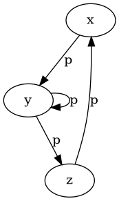
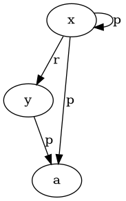
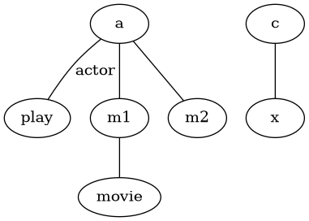
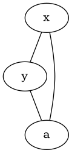
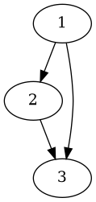

---
tags:
  - TBD
  - cours
---
relativement plus simple : [[Banalisation cours 2]]
### 1. Faits et requêtes conjonctives vus comme des (hyper)graphes

Les **bases de faits** et les **requêtes conjonctives** peuvent être modélisées sous forme de **graphes** ou **hypergraphes**. Ce cadre graphique permet une représentation plus intuitive des relations entre les termes et facilite l'analyse des homomorphismes et des structures minimales.

#### Base de faits avec variables

Une **base de faits** est traditionnellement vue comme un ensemble d'**atomes instanciés**, c’est-à-dire des faits concrets où toutes les variables ont été remplacées par des constantes. Cependant, on peut étendre cette notion pour inclure des **variables quantifiées existentiellement**, afin de représenter des informations partielles ou incomplètes.

- Une base de faits **F** avec variables est vue comme une **conjonction d'atomes**, où toutes les variables sont quantifiées existentiellement. Cela signifie que pour chaque variable, il existe une valeur qui la satisfait, mais cette valeur n’est pas nécessairement connue.

Exemple de base de faits avec variables :
```text
F = { movie(m1), movie(m2), movie(x), actor(a), actor(b), actor(c), 
      play(a, m1), play(a, m2), play(c, x) }
```
La formule logique associée serait :
```text
∃x (movie(m1) ∧ movie(m2) ∧ movie(x) ∧ actor(a) ∧ actor(b) ∧ actor(c) 
     ∧ play(a, m1) ∧ play(a, m2) ∧ play(c, x))
```
Dans cet exemple, **x** est une variable qui peut prendre une valeur, mais cette valeur est inconnue.

#### Requêtes conjonctives

Une **requête conjonctive (CQ)** est une formule de la forme :
```text
Q(x1, ..., xk) = ∃xk+1, ..., xm (A1 ∧ ... ∧ Ap)
```
Où :
- **A1, ..., Ap** sont des **atomes**,
- **x1, ..., xk** sont les **variables réponses**.

Cela signifie que les réponses à la requête sont les valeurs des variables **x1, ..., xk** qui satisfont les atomes.

Exemple de requête conjonctive :
```text
Q(x) = ∃y (movie(y) ∧ play(x, y))
```
Cela signifie : "trouver les acteurs **x** qui ont joué dans un film **y**". La représentation simplifiée serait :
```text
Q(x) = { movie(y), play(x, y) }
```

#### Fragment existentiel conjonctif positif : FOL(∃, ∧)

Le fragment **FOL(∃, ∧)** représente les formules de la logique du premier ordre avec uniquement des **quantificateurs existentiels** (∃) et des **conjonctions** (∧). Ce type de formule est particulièrement adapté pour modéliser des **bases de faits** et des **requêtes conjonctives**. En forme normalisée prénexe, une formule dans FOL(∃, ∧) s'écrit :
```text
∃x1 ... ∃xn (A1 ∧ ... ∧ Ap)
```
Les atomes **A1, ..., Ap** contiennent les variables **x1, ..., xn**, et chaque variable apparaît au moins dans un atome.

##### Homomorphisme

Pour deux formules **f1** et **f2** exprimées dans ce cadre, on dit que **f1** est une **conséquence logique** de **f2** (noté **f1 ⊨ f2**) s'il existe un **homomorphisme** de **f2** vers **f1**. Cela signifie que les variables et prédicats de **f2** peuvent être mappés sur ceux de **f1** de manière à préserver la structure des atomes.

### 2. Vision graphique : Graphes et hypergraphes

#### 2.1 Graphes orientés pour les bases de faits

- Un **graphe orienté** est noté **G = (V, E)**, où :
  - **V** est l’ensemble des **sommets** (ou **termes**),
  - **E** est l’ensemble des **arcs** reliant les sommets (ou **atomes**).

Un ensemble d'atomes avec un seul prédicat binaire peut être vu comme un **graphe orienté**, où :
- Chaque **sommets** correspond à une **variable** ou une **constante**,
- Chaque **arc** représente un **prédicat binaire** reliant deux termes.

**Construction du graphe** :  
Étant donné un ensemble d’atomes **A** contenant uniquement des prédicats binaires, on construit un graphe **G = (V, E)** tel que :
- **V** est en bijection avec les **termes** (variables ou constantes) de **A**,
- **E** est en bijection avec les **atomes** de **A**.

Exemple :  
Soit l'ensemble d'atomes suivant :
```text
{ p(x, y), p(y, z), p(z, x), p(y, y) }
```
Le graphe correspondant est :


#### 2.2 Hypergraphes pour les prédicats d'arité supérieure

Lorsque les prédicats ont une **arité supérieure à 2**, on utilise des **hypergraphes** plutôt que des graphes simples. Un **hypergraphe** est une généralisation d'un graphe où un **hyperarc** peut relier plus de deux sommets.

Pour chaque atome **p(t1, ..., tk)** d’un ensemble d'atomes **F**, on associe un **hyperarc** reliant les **k** termes **t1, ..., tk**.

Exemple d'ensemble d'atomes avec des prédicats d'arité supérieure :
```text
{ p(x, y, a, x), r(x, y) }
```
Le **hypergraphe** correspondant serait :


#### 2.3 Graphe biparti associé à un hypergraphe

Pour rendre les hypergraphes plus simples à manipuler, on peut les transformer en **graphes bipartis**. Dans un graphe biparti, les **sommets** sont divisés en deux ensembles distincts :
- **VT** : les sommets représentant les **termes**,
- **VA** : les sommets représentant les **atomes**.

Chaque **hyperarc** est remplacé par un **sommet atome**, et ce sommet est relié par des arêtes aux sommets représentant les termes de l'atome. Ce procédé donne un **multi-graphe biparti**, dans lequel plusieurs arêtes peuvent relier les mêmes sommets.

Exemple de transformation d'un ensemble d'atomes en graphe biparti :
```text
F = { movie(m1), actor(a), play(a, m1), play(a, m2), play(c, x) }
```
Le **graphe biparti** associé est :


Dans ce schéma, chaque terme est relié à son prédicat (par exemple, **a** est un acteur et joue dans le film **m1**).

### 3. questions clés

- Une base de faits avec variables peut être vue comme un ensemble d'atomes existantiellement quantifiés.
- Une **requête conjonctive** est essentiellement une conjonction d'atomes, et on peut la représenter sous forme de graphe ou d'hypergraphe.
- Les **graphes** sont utilisés lorsque tous les prédicats ont une arité de 2, tandis que les **hypergraphes** sont nécessaires pour les prédicats d’arité supérieure.
- En transformant les hypergraphes en **graphes bipartis**, on facilite l'analyse de la structure des requêtes.

Ces représentations graphiques offrent une perspective visuelle claire pour analyser les homomorphismes entre bases de faits et requêtes, en particulier dans le cadre des **requêtes conjonctives**.
### 4. Le graphe de Gaifman (ou graphe primal)

Le **graphe de Gaifman**, également appelé **graphe primal**, est une autre représentation d’un hypergraphe, qui se concentre sur les relations entre les termes d’un ensemble d’atomes. Contrairement au graphe biparti d’incidence qui encode précisément chaque atome avec ses arguments, le graphe primal capture les connexions entre les termes de manière plus abstraite.

#### Définition du graphe primal
- Le graphe primal et l'hypergraphe associé ont le même ensemble de sommets, qui correspond aux **termes** (variables ou constantes) des atomes.
- Une **arête** est tracée entre deux sommets dans le graphe primal **si et seulement si** ces termes apparaissent ensemble dans un même **hyperarc** de l’hypergraphe.

Exemple :  
Soit l'ensemble d'atomes suivant :
```text
{ p(x, y, a, x), r(x, y) }
```
Le graphe primal correspondant est :

Ici, les termes **x**, **y**, et **a** sont connectés entre eux car ils apparaissent dans les mêmes hyperarcs (les atomes de **p** et **r**).

#### Utilisation du graphe primal
Le graphe primal est utile pour comprendre les connexions entre les termes sans se soucier des relations spécifiques des prédicats. Cependant, il ne permet pas de reconstituer complètement l’hypergraphe d'origine, car il ne capture pas la structure exacte des atomes. À l'inverse, le **graphe biparti d'incidence** permet de reconstituer l'hypergraphe d’origine.

---

### 5. Homomorphismes de graphes

Les **homomorphismes de graphes** sont des fonctions qui préservent les structures entre deux graphes. Un homomorphisme entre deux graphes **G1 = (V1, E1)** et **G2 = (V2, E2)** est une application **h** des sommets de **G1** vers ceux de **G2** telle que, pour chaque arête **(u, v)** dans **G1**, l’arête correspondante **(h(u), h(v))** existe dans **G2**.

#### Définition formelle
Soient **G1 = (V1, E1)** et **G2 = (V2, E2)** deux graphes. Un **homomorphisme** de **G1** vers **G2** est une application **h : V1 → V2** telle que :
- Pour toute arête **(u, v)** dans **E1**, l’arête correspondante **(h(u), h(v))** est dans **E2**.

Exemple :

Ici, un homomorphisme possible de **G1** vers **G2** est :  
- **h(1) = a**,  
- **h(2) = b**,  
- **h(3) = c**.

#### Homomorphismes étiquetés
Si les graphes contiennent des **étiquettes** (labels) sur les sommets ou les arêtes, ces étiquettes doivent également être respectées par l'homomorphisme. Autrement dit, les étiquettes des sommets et des arêtes de **G1** doivent correspondre aux étiquettes des sommets et arêtes correspondants dans **G2**.

Exemple :
Si les arêtes de **G1** sont étiquetées comme suit :
```text
1 --(play)--> 2
```
Alors l’homomorphisme **h** doit mapper cette arête vers une arête de **G2** portant la même étiquette.

---

### 6. Homomorphismes de graphes associés à des ensembles d'atomes

Lorsque les ensembles d'atomes sont traduits en graphes bipartis ou en hypergraphes, les homomorphismes entre ces graphes reflètent les homomorphismes entre les ensembles d'atomes.

#### Traduction des ensembles d’atomes en graphes bipartis
Soient deux ensembles d'atomes **F1** et **F2**. Le graphe biparti associé à **F1** est noté **G1 = (VT1, VA1, E1, label1)**, où :
- **VT1** représente les **termes**,
- **VA1** représente les **atomes**,
- **E1** est l'ensemble des arêtes reliant les termes aux atomes.

Un **homomorphisme** de **F1** vers **F2** est une application **h** des termes et des atomes de **F1** vers ceux de **F2**, telle que :
- Pour tout sommet **v** dans **VT1** (termes), **h(v)** appartient à **VT2**,
- Pour tout sommet **v** dans **VA1** (atomes), **h(v)** appartient à **VA2**,
- Pour toute arête **(a, t)** dans **E1** reliant un atome **a** à un terme **t**, l’arête correspondante **(h(a), h(t))** doit exister dans **E2**,
- Les étiquettes doivent être préservées : **label(e) = label(h(e))**.

#### Homomorphisme entre ensembles d’atomes et graphes
Il existe un homomorphisme entre deux ensembles d'atomes **F1** et **F2** **si et seulement si** il existe un homomorphisme entre les graphes bipartis associés **G1** et **G2**. Cela établit une correspondance directe entre les homomorphismes d’ensembles d’atomes et les homomorphismes de graphes.

---

### 7. Isomorphisme de graphes et ensembles d'atomes

Un **isomorphisme** entre deux ensembles d'atomes **f** et **g** est un **homomorphisme bijectif** qui préserve la structure des atomes. Cela signifie qu'il existe une correspondance parfaite entre les variables et les termes des deux ensembles.

#### Définition de l’isomorphisme
Soit **f** et **g** deux ensembles d’atomes. Un **isomorphisme** de **f** vers **g** est une bijection **h** des variables de **f** vers les variables de **g**, telle que chaque atome de **f** est mappé sur un atome correspondant de **g**.

Exemple :  
Si **f** contient les atomes :
```text
p(x, y), q(y, z)
```
Et **g** contient :
```text
p(a, b), q(b, c)
```
Alors un isomorphisme **h** pourrait être :
```text
h(x) = a, h(y) = b, h(z) = c
```

#### Isomorphisme de graphes
De la même manière, un **isomorphisme** entre deux graphes **G1** et **G2** est une bijection entre leurs sommets qui préserve les arêtes et les étiquettes (si elles existent).

---

### 8. Suppression des redondances : le concept de core

Un **core** est un ensemble minimal d’atomes qui est équivalent à un ensemble d'atomes donné, mais qui ne contient pas d'informations redondantes. Un ensemble d’atomes **f** est dit **minimal** (ou un **core**) s'il ne peut pas être mappé par homomorphisme sur un de ses sous-ensembles stricts.

#### Définition du core
Le **core** d’un ensemble d'atomes **f** est un sous-ensemble minimal de **f** tel que :
- **f** est homomorphiquement équivalent à son core,
- Il est impossible de trouver un sous-ensemble strict de **f** qui soit encore équivalent à **f**.

Un ensemble d'atomes peut avoir plusieurs cores, mais tous ces cores sont **isomorphes** entre eux, ce qui permet de parler du **core** unique de **f**.

Exemple :  
Soit l'ensemble d'atomes **f** suivant :
```text
{ p(x, y), p(y, z), p(z, x), q(x) }
```
Le core de **f** pourrait être :
```text
{ p(x, y), p(y, z), p(z, x) }
```
Si l'atome **q(x)** est redondant et ne modifie pas l'équivalence homomorphique de **f**.

#### Importance du core
Le concept de core est crucial dans plusieurs domaines, notamment dans :
- **L'optimisation des requêtes conjonctives** : en réduisant une requête à son core, on élimine les redondances et on simplifie son exécution.
- **La comparaison de requêtes** : deux requêtes sont dites équivalentes si

 leurs cores sont isomorphes.

---
### 9. Représentation d'une base de données sous différentes perspectives

Dans la théorie des bases de données, une base peut être vue sous plusieurs perspectives. Cela permet de mieux comprendre et manipuler les données selon différentes abstractions.

#### 8.1 Perspective des tables nommées
Une **table** est définie par un **schéma de relation**. Un schéma de relation **R[U]** est constitué :
- d’un nom de relation **R**,
- d’un ensemble fini **U** d’attributs.

La **table** correspondant à ce schéma est un ensemble fini de **fonctions** mappant les attributs aux valeurs provenant d'un domaine **dom**. Ces fonctions permettent de représenter chaque ligne de la table.

#### Exemple : 
Dans une base de données sur les transports :
- **Lines** : représente les types de transports.
- **Stops** : représente les arrêts et leur accessibilité.

On peut décrire ces tables sous forme de fonctions :
```text
LinesI = {{Line ↦ 85, Type ↦ bus}, {Line ↦ 33, Type ↦ tram}}
StopsI = {{SID ↦ 17, Stop ↦ St-Guilhem, Accessible ↦ true}}
```

Une instance de base de données **I** est donc un ensemble fini de tables, comme **LinesI** et **StopsI**.

#### 8.2 Perspective des faits
Une autre manière de représenter une base de données est en tant qu'**ensemble de faits**. Ici, chaque ligne est vue comme un fait utilisant un **symbole de prédicat** (qui correspond au nom de la table) et des **constantes** (les valeurs des lignes).

Exemple :
```text
Lines(85, "bus"), Lines(33, "tram"), Stops(17, "St-Guilhem", true)
```
Dans cette perspective, chaque fait est une instance d'un prédicat **p(t1, ..., tn)**, où :
- **p** est le nom de la table,
- **t1, ..., tn** sont les constantes représentant les valeurs dans la ligne.

#### 8.3 Perspective hypergraphe
Une base de données peut aussi être vue comme un **hypergraphe**. Un **hypergraphe** est une généralisation des graphes où les arêtes peuvent connecter plus de deux sommets (contrairement aux graphes classiques qui ne relient que deux sommets par arête).

Définition d'un hypergraphe :
- **V** : ensemble de **sommets** (représentant les termes ou valeurs),
- **E** : ensemble de **noms d'arêtes** (correspondant aux tables),
- **ρ** : fonction mappant chaque nom d’arête à une relation sur les sommets.

Ainsi, chaque table devient un **hyperarc** reliant plusieurs sommets (les termes de la table).

---

